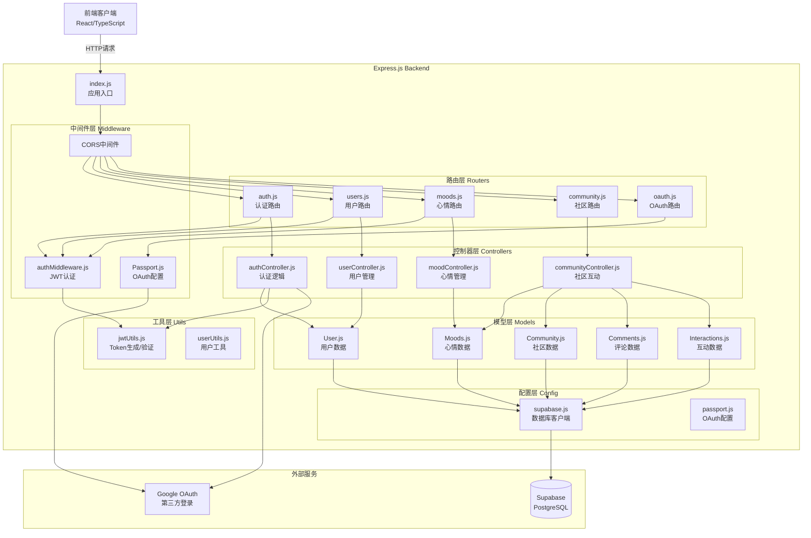

I'll read through the project to understand the architecture and data flow, then generate a high-level data flow diagram in markdown format.

[15 tools called]

现在我已经充分了解了这个项目的架构。这是一个基于 Express.js 的心情追踪应用后端，集成了用户认证、心情记录和社区互动功能。让我为您生成一个高层次的数据流图。

# MoodTrack Backend - High-Level Data Flow 数据流图

## 系统架构概览



## 核心数据流详解

### 1. 用户认证流程

```
┌─────────────┐
│   客户端    │
└──────┬──────┘
       │
       ├─── 注册流程 ───────────────────────────────────┐
       │                                                │
       │  POST /api/auth/register                      │
       │  { name, email, password }                    │
       │                                                ▼
       │                                    ┌──────────────────┐
       │                                    │ authController   │
       │                                    │   .register()    │
       │                                    └────────┬─────────┘
       │                                             │
       │                                             ├─ bcrypt加密密码
       │                                             │
       │                                             ▼
       │                                    ┌──────────────────┐
       │                                    │   User Model     │
       │                                    │ .createUser()    │
       │                                    └────────┬─────────┘
       │                                             │
       │                                             ▼
       │                                    ┌──────────────────┐
       │                                    │  Supabase DB     │
       │                                    │  users表插入     │
       │                                    └────────┬─────────┘
       │                                             │
       │                                             ▼
       │                                    ┌──────────────────┐
       │                                    │  生成JWT Token   │
       │                                    │  jwtUtils.js     │
       │                                    └────────┬─────────┘
       │                                             │
       │  ◄──────────────────────────────────────────┘
       │  { user, token }
       │
       ├─── 登录流程 ───────────────────────────────────┐
       │                                                │
       │  POST /api/auth/login                         │
       │  { email, password }                          │
       │                                                ▼
       │                                    ┌──────────────────┐
       │                                    │ authController   │
       │                                    │    .login()      │
       │                                    └────────┬─────────┘
       │                                             │
       │                                             ├─ 查询用户
       │                                             ├─ bcrypt验证密码
       │                                             │
       │                                             ▼
       │                                    ┌──────────────────┐
       │                                    │  生成JWT Token   │
       │                                    └────────┬─────────┘
       │                                             │
       │  ◄──────────────────────────────────────────┘
       │  { user, token }
       │
       └─── Google OAuth流程 ────────────────────────────┐
                                                         │
         GET /oauth2/authorization/google               │
                                                         ▼
                                            ┌──────────────────┐
                                            │  Passport.js     │
                                            │  Google Strategy │
                                            └────────┬─────────┘
                                                     │
                                                     ▼
                                            ┌──────────────────┐
                                            │  Google OAuth    │
                                            │  用户授权        │
                                            └────────┬─────────┘
                                                     │
         Callback: /api/auth/google/callback        │
                                                     ▼
                                            ┌──────────────────┐
                                            │ 查找或创建用户   │
                                            │  生成JWT Token   │
                                            └────────┬─────────┘
                                                     │
         重定向: /login-callback?token=xxx           │
         ◄───────────────────────────────────────────┘
```

### 2. 心情记录流程

```
┌─────────────┐
│   客户端    │
└──────┬──────┘
       │
       │  Authorization: Bearer <token>
       │
       ├─── 创建心情 ──────────────────────────────────┐
       │                                               │
       │  POST /api/moods                             │
       │  { mood_type, note, triggers,                │
       │    is_public, is_anonymous }                 │
       │                                               ▼
       │                                   ┌──────────────────┐
       │                                   │  authMiddleware  │
       │                                   │  验证JWT Token   │
       │                                   └────────┬─────────┘
       │                                            │
       │                                            ▼
       │                                   ┌──────────────────┐
       │                                   │ moodController   │
       │                                   │ .createMood()    │
       │                                   └────────┬─────────┘
       │                                            │
       │                                            ▼
       │                                   ┌──────────────────┐
       │                                   │   Mood Model     │
       │                                   │ .createMood()    │
       │                                   └────────┬─────────┘
       │                                            │
       │                                            ├─ 验证mood_type
       │                                            ├─ 设置默认值
       │                                            │
       │                                            ▼
       │                                   ┌──────────────────┐
       │                                   │  Supabase DB     │
       │                                   │  moods表插入     │
       │                                   └────────┬─────────┘
       │                                            │
       │  ◄─────────────────────────────────────────┘
       │  { success, data: mood }
       │
       ├─── 获取心情列表 ──────────────────────────────┐
       │                                               │
       │  GET /api/moods                              │
       │                                               ▼
       │                                   ┌──────────────────┐
       │                                   │  authMiddleware  │
       │                                   └────────┬─────────┘
       │                                            │
       │                                            ▼
       │                                   ┌──────────────────┐
       │                                   │ moodController   │
       │                                   │  .getMoods()     │
       │                                   └────────┬─────────┘
       │                                            │
       │                                            ▼
       │                                   ┌──────────────────┐
       │                                   │   Mood Model     │
       │                                   │ 按user_id查询    │
       │                                   └────────┬─────────┘
       │                                            │
       │  ◄─────────────────────────────────────────┘
       │  { success, data: [moods] }
       │
       └─── 删除心情 ──────────────────────────────────┐
                                                       │
            DELETE /api/moods/:id                     │
                                                       ▼
                                           ┌──────────────────┐
                                           │  authMiddleware  │
                                           └────────┬─────────┘
                                                    │
                                                    ▼
                                           ┌──────────────────┐
                                           │ moodController   │
                                           │.deleteMoodById() │
                                           └────────┬─────────┘
                                                    │
                                                    ▼
                                           ┌──────────────────┐
                                           │  Supabase DB     │
                                           │  删除记录        │
                                           └────────┬─────────┘
                                                    │
            ◄───────────────────────────────────────┘
            { success, message }
```

### 3. 社区互动流程

```
┌─────────────┐
│   客户端    │
└──────┬──────┘
       │
       ├─── 获取社区心情 ──────────────────────────────┐
       │                                               │
       │  GET /api/community/moods                    │
       │                                               ▼
       │                                   ┌──────────────────┐
       │                                   │communityController│
       │                                   │.getCommunityMoods│
       │                                   └────────┬─────────┘
       │                                            │
       │                                            ▼
       │                                   ┌──────────────────┐
       │                                   │   Mood Model     │
       │                                   │.getPublicMoods() │
       │                                   └────────┬─────────┘
       │                                            │
       │                                            ├─ 查询is_public=true
       │                                            ├─ 关联users表
       │                                            ├─ 关联interactions表
       │                                            ├─ 关联comments表
       │                                            ├─ 处理匿名信息
       │                                            │
       │                                            ▼
       │                                   ┌──────────────────┐
       │                                   │  数据转换        │
       │                                   │  - 用户信息      │
       │                                   │  - 互动统计      │
       │                                   │  - 评论列表      │
       │                                   └────────┬─────────┘
       │                                            │
       │  ◄─────────────────────────────────────────┘
       │  { success, data: [community_moods] }
       │
       ├─── 点赞心情 ──────────────────────────────────┐
       │                                               │
       │  POST /api/community/moods/:id/like          │
       │  { interaction_type: 'empathy' }             │
       │                                               ▼
       │                                   ┌──────────────────┐
       │                                   │communityController│
       │                                   │.likeCommunityMood│
       │                                   └────────┬─────────┘
       │                                            │
       │                                            ▼
       │                                   ┌──────────────────┐
       │                                   │ Interactions表   │
       │                                   │  插入互动记录    │
       │                                   └────────┬─────────┘
       │                                            │
       │  ◄─────────────────────────────────────────┘
       │  { success, message }
       │
       ├─── 回复心情 ──────────────────────────────────┐
       │                                               │
       │  POST /api/community/moods/:id/reply         │
       │  { content, is_anonymous }                   │
       │                                               ▼
       │                                   ┌──────────────────┐
       │                                   │communityController│
       │                                   │.replyToCommunity │
       │                                   └────────┬─────────┘
       │                                            │
       │                                            ▼
       │                                   ┌──────────────────┐
       │                                   │  Comments表      │
       │                                   │  插入评论记录    │
       │                                   └────────┬─────────┘
       │                                            │
       │  ◄─────────────────────────────────────────┘
       │  { success, data: comment }
       │
       └─── 在线状态管理 ──────────────────────────────┐
                                                       │
            POST /api/community/online-status/        │
                 heartbeat                            │
            Authorization: Bearer <token>             │
                                                       ▼
                                           ┌──────────────────┐
                                           │communityController│
                                           │.updateOnlineStatus│
                                           └────────┬─────────┘
                                                    │
                                                    ▼
                                           ┌──────────────────┐
                                           │ Community Model  │
                                           │.updateUserOnline │
                                           └────────┬─────────┘
                                                    │
                                                    ├─ upsert到online_users表
                                                    ├─ 更新last_active_at
                                                    │
            ◄───────────────────────────────────────┘
            { success }
```

## 数据库表关系

```
┌──────────────┐
│    users     │ 用户表
├──────────────┤
│ id (PK)      │◄────────┐
│ name         │         │
│ email        │         │
│ password_hash│         │
│ created_at   │         │
└──────────────┘         │
                         │
                         │ user_id (FK)
                         │
                    ┌────┴─────────┐
                    │    moods     │ 心情记录表
                    ├──────────────┤
                    │ id (PK)      │◄────────┐
                    │ user_id (FK) │         │
                    │ mood_type    │         │
                    │ note         │         │
                    │ triggers     │         │
                    │ is_public    │         │
                    │ is_anonymous │         │
                    │ likes_count  │         │
                    │ reply_count  │         │
                    │ created_at   │         │
                    └──────────────┘         │
                                             │
                         ┌───────────────────┼───────────────────┐
                         │ mood_id (FK)      │ mood_id (FK)      │
                         │                   │                   │
                ┌────────▼────────┐  ┌───────▼────────┐  ┌──────▼─────────┐
                │ interactions    │  │   comments     │  │ online_users   │
                ├─────────────────┤  ├────────────────┤  ├────────────────┤
                │ id (PK)         │  │ id (PK)        │  │ id (PK)        │
                │ mood_id (FK)    │  │ mood_id (FK)   │  │ user_id (FK)   │
                │ user_id (FK)    │  │ user_id (FK)   │  │ session_id     │
                │ interaction_type│  │ content        │  │ last_active_at │
                │ created_at      │  │ parent_id      │  │ ip_address     │
                └─────────────────┘  │ is_anonymous   │  │ user_agent     │
                                     │ created_at     │  └────────────────┘
                                     └────────────────┘
                                             │
                                             │ parent_id (FK)
                                             │ 自关联（支持评论回复）
                                             └────────────┐
                                                          │
                                                          ▼
```

## 关键技术栈

| 层级 | 技术 | 用途 |
|------|------|------|
| **框架** | Express.js 5.x | Web服务器框架 |
| **数据库** | Supabase (PostgreSQL) | 数据持久化 |
| **认证** | JWT + bcryptjs | Token认证 + 密码加密 |
| **OAuth** | Passport.js + Google OAuth | 第三方登录 |
| **中间件** | CORS, body-parser | 跨域 + 请求解析 |
| **环境配置** | dotenv | 环境变量管理 |

## 安全机制

1. **JWT认证**: 所有受保护的路由都需要有效的JWT Token
2. **密码加密**: 使用bcrypt进行密码哈希（10轮加盐）
3. **CORS配置**: 限制跨域访问来源
4. **匿名保护**: 支持匿名发布心情，自动生成匿名用户信息
5. **内容过滤**: 自动处理敏感内容（个人信息、负面表达）

## API响应格式

所有API遵循统一的响应格式：

```json
{
  "success": true/false,
  "data": { ... },
  "message": "操作描述",
  "error": "错误信息（仅失败时）"
}
```

这个数据流图展示了整个系统的架构层次、数据流向和关键交互过程，便于理解和维护系统。
