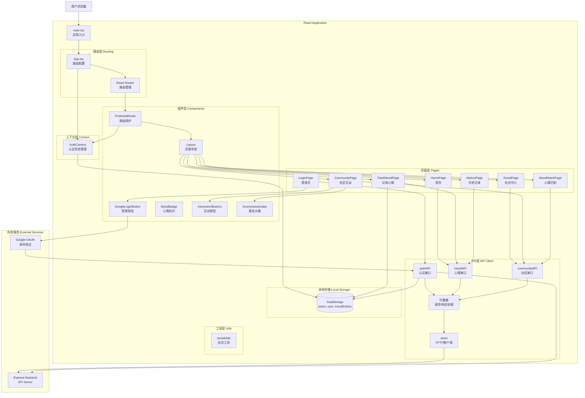

我来阅读前端项目并生成高层次的数据流向图。

[12 tools called]

完美！现在我已经充分了解了前端项目的架构。让我为您生成一个详细的前端数据流向图。

# MoodTrack Frontend - High-Level Data Flow 前端数据流图

## 系统架构概览



## 核心数据流详解

### 1. 用户认证流程

```
┌─────────────┐
│   用户界面  │
└──────┬──────┘
       │
       ├─── Google OAuth 登录 ───────────────────────────────┐
       │                                                      │
       │  点击 Google 登录按钮                                │
       │                                                      ▼
       │                                          ┌──────────────────┐
       │                                          │GoogleLoginButton │
       │                                          │ 触发Google弹窗   │
       │                                          └────────┬─────────┘
       │                                                   │
       │                                                   ▼
       │                                          ┌──────────────────┐
       │                                          │  Google OAuth    │
       │                                          │  用户授权        │
       │                                          └────────┬─────────┘
       │                                                   │
       │                                                   ▼
       │                                          ┌──────────────────┐
       │                                          │ 返回credential   │
       │                                          │ (ID Token)       │
       │                                          └────────┬─────────┘
       │                                                   │
       │                                                   ▼
       │                                          ┌──────────────────┐
       │                                          │   authAPI        │
       │                                          │.verifyGoogleCred │
       │                                          └────────┬─────────┘
       │                                                   │
       │                                                   ▼
       │                                          ┌──────────────────┐
       │                                          │ axios拦截器      │
       │                                          │ 添加headers      │
       │                                          └────────┬─────────┘
       │                                                   │
       │                                                   ▼
       │                                          ┌──────────────────┐
       │                                          │  Backend API     │
       │                                          │ 验证并返回token  │
       │                                          └────────┬─────────┘
       │                                                   │
       │                                                   ▼
       │                                          ┌──────────────────┐
       │                                          │  保存到localStorage│
       │                                          │  - token         │
       │                                          │  - user          │
       │                                          └────────┬─────────┘
       │                                                   │
       │                                                   ▼
       │                                          ┌──────────────────┐
       │                                          │  AuthContext     │
       │                                          │  更新user状态    │
       │                                          └────────┬─────────┘
       │                                                   │
       │  ◄────────────────────────────────────────────────┘
       │  重定向到 /home
       │
       ├─── 路由保护机制 ─────────────────────────────────────┐
       │                                                      │
       │  访问受保护路由 (如 /home)                           │
       │                                                      ▼
       │                                          ┌──────────────────┐
       │                                          │ ProtectedRoute   │
       │                                          │ 检查认证状态     │
       │                                          └────────┬─────────┘
       │                                                   │
       │                                                   ├─ 检查 user
       │                                                   ├─ 检查 isLoading
       │                                                   │
       │                                                   ▼
       │                                          ┌──────────────────┐
       │                                          │  AuthContext     │
       │                                          │  获取user状态    │
       │                                          └────────┬─────────┘
       │                                                   │
       │                                                   ├─ 如果未登录
       │                                                   │  → 重定向到 /login
       │                                                   │
       │                                                   ├─ 如果已登录
       │                                                   │  → 渲染页面内容
       │                                                   │
       │  ◄────────────────────────────────────────────────┘
       │
       └─── 自动登录恢复 ─────────────────────────────────────┐
                                                              │
            页面刷新/重新打开                                 │
                                                              ▼
                                                  ┌──────────────────┐
                                                  │  AuthContext     │
                                                  │  useEffect初始化 │
                                                  └────────┬─────────┘
                                                           │
                                                           ▼
                                                  ┌──────────────────┐
                                                  │ localStorage     │
                                                  │ 读取user和token  │
                                                  └────────┬─────────┘
                                                           │
                                                           ├─ 如果存在
                                                           │  → 恢复user状态
                                                           │
                                                           ├─ 如果不存在
                                                           │  → 保持未登录
                                                           │
            ◄──────────────────────────────────────────────┘
```

### 2. 心情记录流程

```
┌─────────────┐
│ TrackMoodPage│
└──────┬──────┘
       │
       ├─── 创建心情记录 ──────────────────────────────────┐
       │                                                   │
       │  1. 用户选择心情 (1-5级)                          │
       │  2. 选择影响因素 (triggers)                       │
       │  3. 填写备注 (note)                               │
       │                                                   ▼
       │                                       ┌──────────────────┐
       │                                       │  表单状态管理    │
       │                                       │  useState        │
       │                                       │  - selectedMood  │
       │                                       │  - note          │
       │                                       │  - triggers      │
       │                                       └────────┬─────────┘
       │                                                │
       │  4. 点击"分享心情"按钮                         │
       │                                                ▼
       │                                       ┌──────────────────┐
       │                                       │  handleSubmit    │
       │                                       │  构建moodEntry   │
       │                                       └────────┬─────────┘
       │                                                │
       │                                                ├─ 数据格式转换
       │                                                │  mood_type: 'good'
       │                                                │  triggers: [...]
       │                                                │  is_public: true
       │                                                │  is_anonymous: false
       │                                                │
       │                                                ▼
       │                                       ┌──────────────────┐
       │                                       │   moodAPI        │
       │                                       │  .createMood()   │
       │                                       └────────┬─────────┘
       │                                                │
       │                                                ▼
       │                                       ┌──────────────────┐
       │                                       │  axios拦截器     │
       │                                       │  自动添加token   │
       │                                       └────────┬─────────┘
       │                                                │
       │                                                ▼
       │                                       ┌──────────────────┐
       │                                       │ POST /api/moods  │
       │                                       │  Backend API     │
       │                                       └────────┬─────────┘
       │                                                │
       │                                                ▼
       │                                       ┌──────────────────┐
       │                                       │  并行保存        │
       │                                       │  1. 后端数据库   │
       │                                       │  2. localStorage │
       │                                       └────────┬─────────┘
       │                                                │
       │                                                ▼
       │                                       ┌──────────────────┐
       │                                       │  显示成功提示    │
       │                                       │  重置表单        │
       │                                       └────────┬─────────┘
       │                                                │
       │  ◄─────────────────────────────────────────────┘
       │  { success: true, data: mood }
       │
       ├─── 获取心情历史 ──────────────────────────────────┐
       │                                                   │
       │  HistoryPage 加载                                 │
       │                                                   ▼
       │                                       ┌──────────────────┐
       │                                       │   useEffect      │
       │                                       │   组件挂载时     │
       │                                       └────────┬─────────┘
       │                                                │
       │                                                ▼
       │                                       ┌──────────────────┐
       │                                       │   moodAPI        │
       │                                       │   .getMoods()    │
       │                                       └────────┬─────────┘
       │                                                │
       │                                                ▼
       │                                       ┌──────────────────┐
       │                                       │ GET /api/moods   │
       │                                       │  Backend API     │
       │                                       └────────┬─────────┘
       │                                                │
       │                                                ▼
       │                                       ┌──────────────────┐
       │                                       │  数据处理        │
       │                                       │  - 排序          │
       │                                       │  - 统计分析      │
       │                                       │  - 趋势计算      │
       │                                       └────────┬─────────┘
       │                                                │
       │                                                ▼
       │                                       ┌──────────────────┐
       │                                       │  更新UI状态      │
       │                                       │  渲染图表/列表   │
       │                                       └────────┬─────────┘
       │                                                │
       │  ◄─────────────────────────────────────────────┘
       │  显示心情历史
       │
       └─── AI分析生成 ────────────────────────────────────┐
                                                           │
            HomePage - 点击"生成分析报告"                  │
                                                           ▼
                                               ┌──────────────────┐
                                               │ generateAnalysis │
                                               │ Report()         │
                                               └────────┬─────────┘
                                                        │
                                                        ├─ 获取日期范围
                                                        ├─ 构建请求参数
                                                        │
                                                        ▼
                                               ┌──────────────────┐
                                               │ POST /api/v1/    │
                                               │ ai-analysis/     │
                                               │ generate         │
                                               └────────┬─────────┘
                                                        │
                                                        ▼
                                               ┌──────────────────┐
                                               │  显示分析结果    │
                                               │  支持重新生成    │
                                               └────────┬─────────┘
                                                        │
            ◄───────────────────────────────────────────┘
```

### 3. 社区互动流程

```
┌─────────────┐
│CommunityPage│
└──────┬──────┘
       │
       ├─── 获取社区话题 ──────────────────────────────────┐
       │                                                   │
       │  页面加载时                                       │
       │                                                   ▼
       │                                       ┌──────────────────┐
       │                                       │   useEffect      │
       │                                       │   初始化         │
       │                                       └────────┬─────────┘
       │                                                │
       │                                                ▼
       │                                       ┌──────────────────┐
       │                                       │  communityAPI    │
       │                                       │.getCommunityTopics│
       │                                       └────────┬─────────┘
       │                                                │
       │                                                ▼
       │                                       ┌──────────────────┐
       │                                       │GET /api/community│
       │                                       │    /topics       │
       │                                       └────────┬─────────┘
       │                                                │
       │                                                ▼
       │                                       ┌──────────────────┐
       │                                       │  渲染话题列表    │
       │                                       │  - 热门话题      │
       │                                       │  - 所有话题      │
       │                                       └────────┬─────────┘
       │                                                │
       │  ◄─────────────────────────────────────────────┘
       │
       ├─── 查看话题内容 ──────────────────────────────────┐
       │                                                   │
       │  点击话题卡片                                     │
       │                                                   ▼
       │                                       ┌──────────────────┐
       │                                       │ handleTopicClick │
       │                                       │ 设置selectedTopic│
       │                                       └────────┬─────────┘
       │                                                │
       │                                                ▼
       │                                       ┌──────────────────┐
       │                                       │  communityAPI    │
       │                                       │.getCommunityPosts│
       │                                       └────────┬─────────┘
       │                                                │
       │                                                ▼
       │                                       ┌──────────────────┐
       │                                       │GET /api/community│
       │                                       │    /moods        │
       │                                       └────────┬─────────┘
       │                                                │
       │                                                ├─ 返回数据包含:
       │                                                │  - user信息
       │                                                │  - mood内容
       │                                                │  - interactions
       │                                                │  - replies
       │                                                │  - tags
       │                                                │
       │                                                ▼
       │                                       ┌──────────────────┐
       │                                       │  数据处理        │
       │                                       │  - 匿名用户处理  │
       │                                       │  - 时间格式化    │
       │                                       │  - 互动统计      │
       │                                       └────────┬─────────┘
       │                                                │
       │                                                ▼
       │                                       ┌──────────────────┐
       │                                       │  渲染帖子列表    │
       │                                       │  - 用户头像      │
       │                                       │  - 心情内容      │
       │                                       │  - 互动按钮      │
       │                                       │  - 评论列表      │
       │                                       └────────┬─────────┘
       │                                                │
       │  ◄─────────────────────────────────────────────┘
       │
       ├─── 互动操作 ──────────────────────────────────────┐
       │                                                   │
       │  点击互动按钮 (共鸣/支持/帮助/感谢/鼓励)          │
       │                                                   ▼
       │                                       ┌──────────────────┐
       │                                       │handleInteraction │
       │                                       │ 乐观更新UI       │
       │                                       └────────┬─────────┘
       │                                                │
       │                                                ├─ 立即更新本地状态
       │                                                │  interactions[type]++
       │                                                │
       │                                                ▼
       │                                       ┌──────────────────┐
       │                                       │  communityAPI    │
       │                                       │.likeCommunityMood│
       │                                       └────────┬─────────┘
       │                                                │
       │                                                ▼
       │                                       ┌──────────────────┐
       │                                       │POST /api/community│
       │                                       │/moods/:id/like   │
       │                                       └────────┬─────────┘
       │                                                │
       │                                                ├─ 成功: 保持UI更新
       │                                                ├─ 失败: 回滚UI更新
       │                                                │
       │  ◄─────────────────────────────────────────────┘
       │
       ├─── 在线状态管理 ──────────────────────────────────┐
       │                                                   │
       │  定时心跳机制 (每30秒)                            │
       │                                                   ▼
       │                                       ┌──────────────────┐
       │                                       │   setInterval    │
       │                                       │   定时器         │
       │                                       └────────┬─────────┘
       │                                                │
       │                                                ▼
       │                                       ┌──────────────────┐
       │                                       │  communityAPI    │
       │                                       │.updateOnlineStatus│
       │                                       └────────┬─────────┘
       │                                                │
       │                                                ▼
       │                                       ┌──────────────────┐
       │                                       │POST /api/community│
       │                                       │/online-status/   │
       │                                       │heartbeat         │
       │                                       └────────┬─────────┘
       │                                                │
       │                                                ▼
       │                                       ┌──────────────────┐
       │                                       │ 更新在线用户列表 │
       │                                       │ 显示在线状态     │
       │                                       └────────┬─────────┘
       │                                                │
       │  ◄─────────────────────────────────────────────┘
       │
       └─── 匿名社交系统 ──────────────────────────────────┐
                                                           │
            socialUtils.generateAnonymousUser()           │
                                                           ▼
                                               ┌──────────────────┐
                                               │  基于userId生成  │
                                               │  - 随机昵称      │
                                               │  - 渐变头像      │
                                               │  - 一致性保证    │
                                               └────────┬─────────┘
                                                        │
                                                        ▼
                                               ┌──────────────────┐
                                               │  AnonymousAvatar │
                                               │  组件渲染        │
                                               └────────┬─────────┘
                                                        │
            ◄───────────────────────────────────────────┘
```

### 4. API请求拦截器机制

```
┌─────────────┐
│  任何API调用 │
└──────┬──────┘
       │
       ├─── 请求拦截器 (Request Interceptor) ─────────────┐
       │                                                   │
       │  apiClient.interceptors.request.use()            │
       │                                                   ▼
       │                                       ┌──────────────────┐
       │                                       │  读取localStorage│
       │                                       │  获取token       │
       │                                       └────────┬─────────┘
       │                                                │
       │                                                ▼
       │                                       ┌──────────────────┐
       │                                       │  添加请求头      │
       │                                       │  Authorization:  │
       │                                       │  Bearer <token>  │
       │                                       └────────┬─────────┘
       │                                                │
       │                                                ▼
       │                                       ┌──────────────────┐
       │                                       │  发送HTTP请求    │
       │                                       │  到Backend       │
       │                                       └────────┬─────────┘
       │                                                │
       ├─── 响应拦截器 (Response Interceptor) ────────────┤
       │                                                │
       │  apiClient.interceptors.response.use()        │
       │                                                ▼
       │                                       ┌──────────────────┐
       │                                       │  检查响应状态    │
       │                                       └────────┬─────────┘
       │                                                │
       │                                                ├─ 200-299: 成功
       │                                                │  → 返回response.data
       │                                                │
       │                                                ├─ 401: 未授权
       │                                                │  → 触发AUTH_ERROR_EVENT
       │                                                │  → 清除localStorage
       │                                                │  → 重定向到/login
       │                                                │
       │                                                ├─ 其他错误
       │                                                │  → 返回错误信息
       │                                                │
       │  ◄─────────────────────────────────────────────┘
       │  返回处理后的数据/错误
       │
       └─── 错误处理流程 ──────────────────────────────────┐
                                                           │
            401错误触发                                    │
                                                           ▼
                                               ┌──────────────────┐
                                               │ dispatchEvent    │
                                               │ AUTH_ERROR_EVENT │
                                               └────────┬─────────┘
                                                        │
                                                        ▼
                                               ┌──────────────────┐
                                               │  AuthContext     │
                                               │  监听事件        │
                                               └────────┬─────────┘
                                                        │
                                                        ▼
                                               ┌──────────────────┐
                                               │ handleAuthError  │
                                               │ - 清除user状态   │
                                               │ - 清除localStorage│
                                               │ - 跳转到/login   │
                                               └────────┬─────────┘
                                                        │
            ◄───────────────────────────────────────────┘
```

## 状态管理架构

```
┌────────────────────────────────────────────────────────┐
│                    全局状态管理                         │
├────────────────────────────────────────────────────────┤
│                                                         │
│  AuthContext (React Context)                           │
│  ├─ user: User | null                                  │
│  ├─ isLoading: boolean                                 │
│  ├─ login(token)                                       │
│  ├─ logout()                                           │
│  ├─ handleCallbackToken(token)                         │
│  └─ refreshUserFromStorage()                           │
│                                                         │
└────────────────────────────────────────────────────────┘
                          │
                          │ 提供给所有子组件
                          │
        ┌─────────────────┼─────────────────┐
        │                 │                 │
        ▼                 ▼                 ▼
┌──────────────┐  ┌──────────────┐  ┌──────────────┐
│ ProtectedRoute│  │    Layout    │  │  所有Pages   │
│  检查认证状态 │  │  显示用户信息 │  │  访问user    │
└──────────────┘  └──────────────┘  └──────────────┘

┌────────────────────────────────────────────────────────┐
│                    本地状态管理                         │
├────────────────────────────────────────────────────────┤
│                                                         │
│  TrackMoodPage (useState)                              │
│  ├─ selectedMood: number | null                        │
│  ├─ note: string                                       │
│  ├─ selectedTriggers: string[]                         │
│  ├─ loading: boolean                                   │
│  └─ showSuccess: boolean                               │
│                                                         │
│  CommunityPage (useState)                              │
│  ├─ topics: EmotionTopic[]                             │
│  ├─ posts: CommunityPost[]                             │
│  ├─ selectedTopic: string | null                       │
│  ├─ showingPosts: boolean                              │
│  └─ loading: boolean                                   │
│                                                         │
│  HomePage (useState)                                   │
│  ├─ isGenerating: boolean                              │
│  └─ analysisResult: string | null                      │
│                                                         │
└────────────────────────────────────────────────────────┘

┌────────────────────────────────────────────────────────┐
│                  持久化存储 (localStorage)              │
├────────────────────────────────────────────────────────┤
│                                                         │
│  认证相关:                                              │
│  ├─ token: string                    (JWT Token)       │
│  ├─ user: string                     (JSON序列化)      │
│  ├─ google_token: string             (Google Token)    │
│  └─ google_user_info: string         (Google用户信息)  │
│                                                         │
│  数据缓存:                                              │
│  └─ moodEntries: string              (心情记录数组)    │
│                                                         │
└────────────────────────────────────────────────────────┘
```

## 组件层次结构

```
App.tsx (路由配置)
│
├─ AuthProvider (全局认证状态)
│  │
│  ├─ LoginPage
│  │  └─ GoogleLoginButton
│  │
│  ├─ LoginCallback (OAuth回调处理)
│  │
│  └─ ProtectedRoute (路由保护)
│     │
│     └─ Layout (页面布局)
│        │
│        ├─ 导航栏
│        │  ├─ Logo
│        │  ├─ 导航链接
│        │  └─ 用户菜单
│        │
│        └─ 页面内容
│           │
│           ├─ HomePage
│           │  ├─ 功能卡片
│           │  └─ AI分析面板
│           │
│           ├─ TrackMoodPage
│           │  ├─ 心情选择器
│           │  ├─ 影响因素选择
│           │  ├─ 备注输入
│           │  └─ 提交按钮
│           │
│           ├─ HistoryPage
│           │  ├─ 统计卡片
│           │  ├─ 趋势图表
│           │  └─ 心情列表
│           │
│           ├─ SocialPage
│           │  ├─ 在线用户
│           │  ├─ 心情匹配
│           │  └─ 社区入口
│           │
│           ├─ CommunityPage
│           │  ├─ 话题列表
│           │  │  ├─ 话题卡片
│           │  │  └─ 统计信息
│           │  │
│           │  └─ 帖子列表
│           │     ├─ AnonymousAvatar
│           │     ├─ MoodBadge
│           │     ├─ InteractionButtons
│           │     └─ 评论列表
│           │
│           └─ MoodMatchPage
│              ├─ 匹配用户卡片
│              ├─ SimilarityBadge
│              └─ 互动按钮
```

## 数据类型定义

```typescript
// 用户类型
interface User {
  id: string;
  email: string;
  name: string;
  picture?: string;
}

// 心情记录类型
interface MoodEntry {
  mood: number;              // 1-5
  mood_type: string;         // 'very_bad' | 'bad' | 'neutral' | 'good' | 'excellent'
  note: string;
  triggers: string[];
  is_public: boolean;
  is_anonymous: boolean;
  timestamp: string;
}

// 社区帖子类型
interface CommunityPost {
  id: string;
  user: AnonymousUser;
  content: string;
  processedContent: string;
  mood: number;
  mood_type: string;
  created_at: string;
  interactions: {
    empathy: number;         // 共鸣
    support: number;         // 支持
    helpful: number;         // 帮助
    grateful: number;        // 感谢
    encourage: number;       // 鼓励
  };
  replies: Reply[];
  tags: string[];
}

// 匿名用户类型
interface AnonymousUser {
  id: string;
  name: string;              // 随机生成的昵称
  email: string;
  avatar: string;            // Tailwind渐变类名
  isOnline: boolean;
  lastActive: string | null;
}

// 社区话题类型
interface EmotionTopic {
  id: string;
  name: string;
  description: string;
  emoji: string;
  participantCount: number;
  recentPosts: number;
  trending: boolean;
  tags: string[];
}
```

## 关键技术特性

| 特性 | 实现方式 | 用途 |
|------|---------|------|
| **路由管理** | React Router v6 | SPA路由、路由保护 |
| **状态管理** | React Context + useState | 全局认证状态、组件本地状态 |
| **HTTP客户端** | Axios + 拦截器 | API请求、自动认证、错误处理 |
| **认证机制** | JWT + Google OAuth | 用户认证、会话管理 |
| **数据持久化** | localStorage | Token存储、用户信息缓存 |
| **样式系统** | Tailwind CSS v4 | 响应式设计、组件样式 |
| **图标库** | Lucide React | UI图标组件 |
| **构建工具** | Vite | 快速开发、热更新 |
| **类型安全** | TypeScript | 类型检查、代码提示 |

## API端点映射

```typescript
// 认证API
authAPI = {
  verifyGoogleCredential: POST /api/auth/verify-google-credential
  userRegister:           POST /api/auth/register
  userLogin:              POST /api/auth/login
  verifyCallbackToken:    POST /api/auth/verify-token
  refreshToken:           POST /api/auth/refresh
  logout:                 POST /api/auth/logout
}

// 心情API
moodAPI = {
  createMood:  POST   /api/moods
  getMoods:    GET    /api/moods
  getMood:     GET    /api/moods/:id
  deleteMood:  DELETE /api/moods/:id
}

// 社区API
communityAPI = {
  getCommunityTopics:   GET  /api/community/topics
  updateOnlineStatus:   POST /api/community/online-status/heartbeat
  removeOnlineStatus:   POST /api/community/online-status/remove
  getOnlineUsers:       GET  /api/community/online-users
  getCommunityPosts:    GET  /api/community/moods
  getCommunityMood:     GET  /api/community/moods/:id
  likeCommunityMood:    POST /api/community/moods/:id/like
  unlikeCommunityMood:  POST /api/community/moods/:id/unlike
  replyToCommunityMood: POST /api/community/moods/:id/reply
}
```

## 性能优化策略

1. **代码分割**: React.lazy() + Suspense (待实现)
2. **乐观更新**: 互动操作立即更新UI，后台同步
3. **请求缓存**: localStorage缓存心情记录
4. **防抖节流**: 搜索、滚动等操作优化
5. **图片优化**: 使用渐变背景代替图片头像
6. **懒加载**: 长列表虚拟滚动 (待实现)

## 错误处理机制

```
┌─────────────────────────────────────────┐
│           错误处理层次                   │
├─────────────────────────────────────────┤
│                                          │
│  1. API层错误处理                        │
│     ├─ axios拦截器捕获                   │
│     ├─ 401错误 → 触发登出                │
│     └─ 其他错误 → 返回错误信息           │
│                                          │
│  2. 组件层错误处理                       │
│     ├─ try-catch包裹异步操作             │
│     ├─ 显示错误提示                      │
│     └─ 降级UI显示                        │
│                                          │
│  3. 全局错误边界 (待实现)                │
│     ├─ ErrorBoundary组件                 │
│     └─ 友好错误页面                      │
│                                          │
└─────────────────────────────────────────┘
```

这个数据流图展示了MoodTrack前端应用的完整架构，包括路由管理、状态管理、API交互、组件层次和数据流向，便于理解和维护整个前端系统。